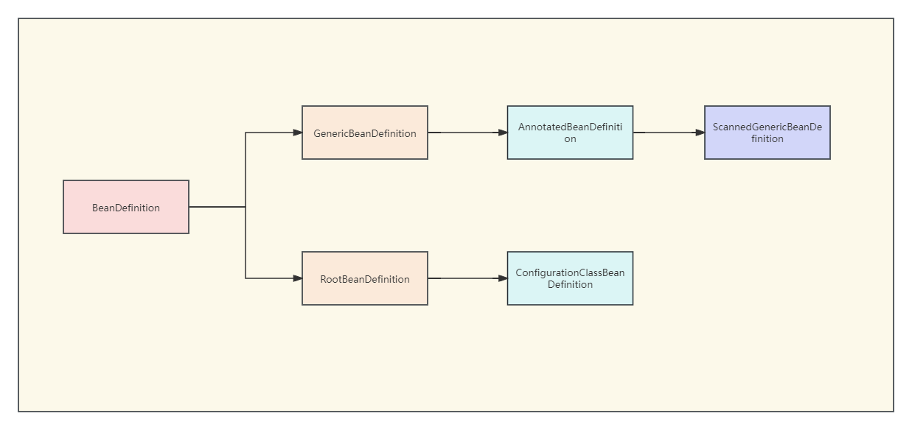

# 俯瞰Spring

Spring启动流程：


- **BeanFactoryPostProcessor**

接口定义如下：

```java
@FunctionalInterface
public interface BeanFactoryPostProcessor {
	void postProcessBeanFactory(ConfigurableListableBeanFactory beanFactory) throws BeansException;
}
```

可通过beanFactory获取BeanDefinition，并对它的属性做修改。

常见应用场景：解析bean定义属性值中的占位符，替换成实际值，如配置数据源：

```xml
<bean id="dataSource" class="org.springframework.jdbc.datasource.DriverManagerDataSource">
    <property name="driverClassName" value="${driver}"/>
    <property name="url" value="jdbc:${dbname}" />
</bean>
```

- **BeanPostProcessor**

接口定义信息如下：

```java
public interface BeanPostProcessor {

	@Nullable
	default Object postProcessBeforeInitialization(Object bean, String beanName) throws BeansException {
		return bean;
	}

	@Nullable
	default Object postProcessAfterInitialization(Object bean, String beanName) throws BeansException {
		return bean;
	}

}
```

在Spring容器中，分别在bean初始化前后执行postProcessBeforeInitialization和postProcessAfterInitialization方法。

应用场景：AOP的相关抽象类`AbstractAutoProxyCreator`实现了此接口。

- **BeanFactory**和**FactoryBean**

BeanFactory和FactoryBean都是用来创建对象的。当使用BeanFactory时，必须遵循完整的bean创建过程，这个过程是由Spring来管理控制的。

而使用FactoryBean只需要调用getObject就可以返回具体的对象，这个对象的创建过程是由用户自己控制的。

- **BeanDefinition**

beanDefinition的实现类：


- GenericBeanDefinition       
  
  通过扫描xml文件，读取的自定义的普通bean对象会被解析成GenericBeanDefinition

- ScannedGenericBeanDefinition

  通过开启注解扫描获取的bean，会被解析成ScannedGenericBeanDefinition

  